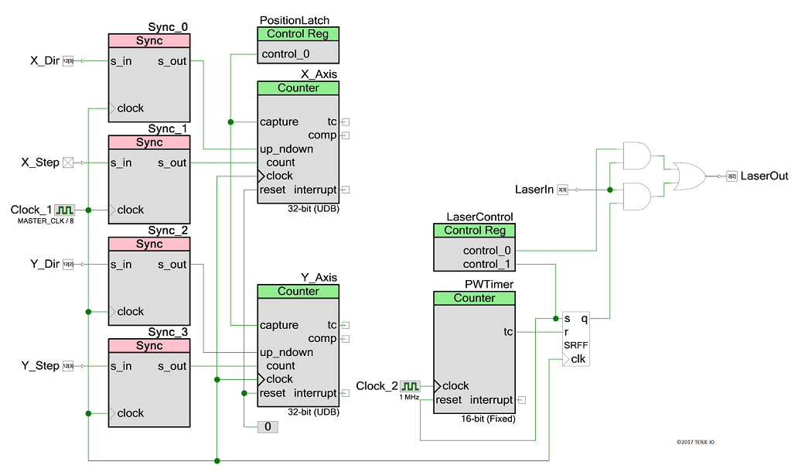

# PSoC 5 Laser PPI Module for USD 10
#### on a CY8CKIT-059 development board

### **EXPERIMENTAL**

Features 32-bit up/down counters for X and Y step position capture, microsecond resolution pulse width control and pass-through mode.

Based on [blog post](http://www.buildlog.net/blog/2011/12/getting-more-power-and-cutting-accuracy-out-of-your-home-built-laser-system/) by dirktheeng.

This solution uses PSoC UDBs so no external electronics is required. It has a simple UART command interface, a more flexible one using I2C or SPI communication can easily be added - for possible gcode control.

**NOTE:** only bench tested with [grbl](https://github.com/terjeio/grbl) and a LED as a stand in for the laser.

